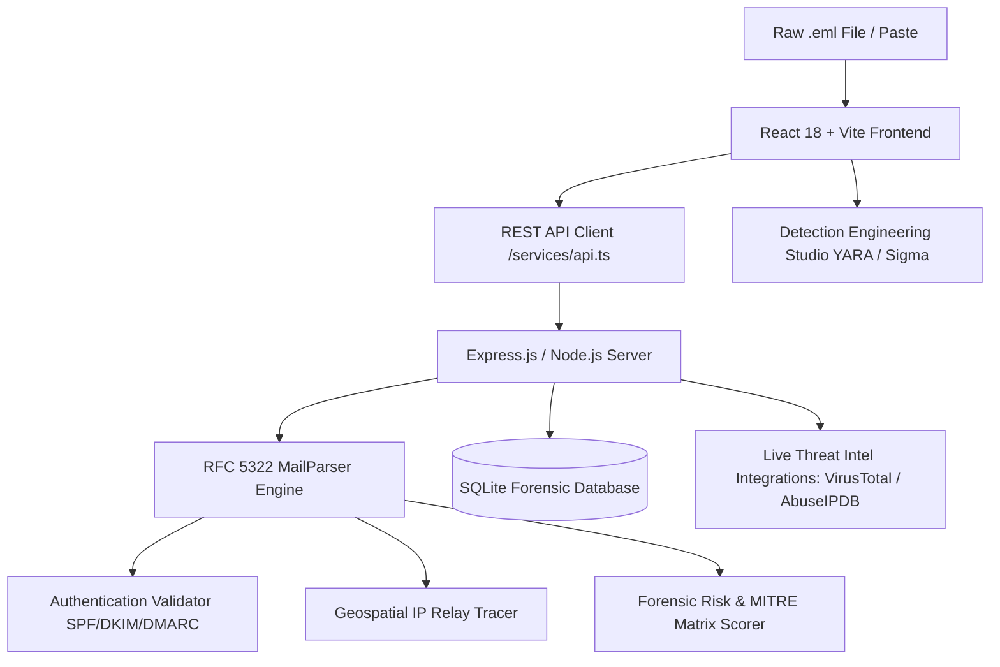

# 🛡️ MailTrace AI — Autonomous Email Threat Detection & Forensic Intelligence Platform

<p align="center">
  
  
  
  
  
  
  
</p>

<p align="center">
  <b>A next-generation Security Operations Center (SOC) platform for autonomous email parsing, RFC 5322 header forensics, multi-hop relay telemetry, MITRE ATT&CK mapping, and automated YARA/Sigma detection engineering.</b>
</p>

---

## 📌 Executive Overview

**MailTrace AI** is an enterprise-grade **Autonomous Email Security Operations Center (SOC) & Threat Forensics Platform**. Purpose-built for Tier-1/Tier-2 SOC analysts, DFIR teams, and security researchers, MailTrace AI ingests raw RFC 5322 `.eml` files, traces transmission pathways, executes forensic header analysis, tracks IP relay hops across global infrastructure, and computes explainable multi-vector threat risk scores.

The platform empowers security teams to detect and neutralize advanced spear phishing, CEO fraud/BEC (Business Email Compromise), malware dropper attachments, and credential harvesting campaigns in seconds.

---

## ✨ Key Capabilities & Highlights

| Feature | Description |
| :--- | :--- |
| 🌓 **Dual-Engine SOC Theme** | 1-Click switch between **Cyber SOC Obsidian Dark** (`#0B0F17`) and **Crisp Emerald White** light mode with persistent storage. |
| ⚡ **Forensic Command Palette** | Global keyboard-driven (`Ctrl + K` / `Cmd + K`) quick navigation, simulation launcher, and instant action engine. |
| 🛡️ **Detection Engineering Studio** | Auto-compiles IoCs into production **YARA rules**, **Sigma rules** (Splunk/Elastic/Sentinel), and **Suricata/Snort NIDS** signatures. |
| 🔬 **RFC 5322 Syntax Anomaly Diff** | Side-by-side structured forensic table & raw header stream highlighting forged hops and MTA anomalies. |
| 🗺️ **Multi-Hop Relay Geo-Tracer** | Visual hop-by-hop tracking of the email relay journey across international ISPs with zero external API key requirements. |
| 📊 **SOC Dossier & Confidence Matrix** | 0–100 explainable risk scoring mapped to **MITRE ATT&CK** (`T1566`, `T1566.002`, `T1204`). |
| 📋 **ITSM Incident Ticket Formatter** | 1-Click structured incident report generator tailored for **Jira Service Management** and **ServiceNow**. |
| 💼 **Evidence Vault & Chain of Custody** | Automated cryptographic hashing (MD5, SHA-1, SHA-256) of raw email files and payload attachments. |

---

## 📑 Standards & Protocols Compliance

MailTrace AI adheres strictly to core internet messaging and cybersecurity standards:
- **RFC 5322**: Internet Message Format parsing and structural syntax validation.
- **RFC 7208**: Sender Policy Framework (SPF) authentication & record verification.
- **RFC 6376**: DomainKeys Identified Mail (DKIM) cryptographic signature verification.
- **RFC 7489**: Domain-based Message Authentication, Reporting, and Conformance (DMARC).
- **MITRE ATT&CK Matrix**: Tactical alignment with Initial Access & Execution vectors.

---

## ⌨️ Forensic Keyboard Shortcuts

| Shortcut | Action | Scope |
| :--- | :--- | :--- |
| <kbd>Ctrl</kbd> + <kbd>K</kbd> / <kbd>Cmd</kbd> + <kbd>K</kbd> | Open Global Forensic Command Palette | Global |
| <kbd>Esc</kbd> | Dismiss any open modal or inspector | Global |
| <kbd>1-Click</kbd> Attack Loader | Instant simulation (CEO Fraud, M365 Phish, Malware Dropper) | Palette / Investigate |

---

## 🛠️ Architecture & Tech Stack



### Architecture Breakdown
- **Frontend**: React 18, TypeScript, Vite, Tailwind CSS with dynamic CSS variables, Lucide React, Recharts, Leaflet / OpenStreetMap.
- **Backend**: Node.js, Express, TypeScript, `mailparser` (RFC 5322 stream engine), Better-SQLite3, Axios.
- **Security & Integrity**: JWT Authentication, bcrypt password hashing, SHA-256 payload integrity hashing.

---

## 📁 Repository Structure

```
MailtraceAI/
├── client/                     # Frontend Single Page Application
│   ├── src/
│   │   ├── components/         # Reusable SOC & Forensics UI widgets
│   │   │   ├── CommandPaletteModal.tsx    # Global Ctrl+K Command Palette
│   │   │   ├── DetectionRulesModal.tsx    # Live YARA, Sigma & Suricata Studio
│   │   │   ├── HeaderForensicsTable.tsx   # RFC 5322 Anomaly Diff & Table
│   │   │   ├── ExportReportModal.tsx      # Jira & ServiceNow Formatter
│   │   │   ├── GeoMap.tsx                 # Multi-Hop Visual Map
│   │   │   └── ...
│   │   ├── context/            # AuthContext & Dynamic ThemeContext (Light/Dark)
│   │   ├── pages/              # Dashboard, Investigate, Cases, Intel, History
│   │   └── services/           # Axios API client
│   └── tailwind.config.js      # Dynamic SOC color palette configuration
├── server/                     # Backend API & Threat Forensics Engine
│   ├── src/
│   │   ├── ai/                 # Threat detection & confidence matrix scoring
│   │   ├── controllers/        # Investigation, Cases, Intel, Auth endpoints
│   │   ├── intelligence/       # Header parsing, IoC extraction, lookalike detection
│   │   ├── models/             # SQLite schema and persistent database
│   │   └── parsers/            # RFC 5322 mailparser stream pipelines
│   └── data/                   # SQLite database storage (gitignored)
├── start.bat                   # 1-Click Windows Batch Launcher
├── start.ps1                   # 1-Click Windows PowerShell Launcher
├── stop.bat                    # 1-Click Graceful Shutdown Script
├── .gitignore                  # Production gitignore hygiene
└── README.md                   # Project documentation
```

---

## 🚀 Quickstart & Installation

### Prerequisites
- [Node.js](https://nodejs.org/) (v18.0 or higher recommended)
- `npm` (bundled with Node.js)
- `git`

### 1. Clone the Repository
```bash
git clone https://github.com/Aadityasingh08/MailtraceAI.git
cd MailtraceAI
```

### 2. Install Dependencies
```bash
# Automatically install root, client, and server dependencies
npm run install:all
```
*(Or install manually in each subfolder)*:
```bash
cd server && npm install
cd ../client && npm install
```

### 3. Environment Configuration (Optional)
The platform runs immediately out-of-the-box with local SQLite and built-in sample intel. To connect external threat feeds:
```bash
cp server/.env.example server/.env
```
Edit `server/.env`:
```env
PORT=5000
JWT_SECRET=super-secret-jwt-key-mailtrace-soc-2025
VIRUSTOTAL_API_KEY=your_key_here
ABUSEIPDB_API_KEY=your_key_here
```

### 4. 1-Click Launch

#### Windows (Instant Launcher):
Double-click `start.bat` or run in PowerShell:
```powershell
.\start.ps1
```

#### Terminal / Manual:
```bash
# Terminal 1: Backend Server (Port 5000)
cd server
npm run dev

# Terminal 2: Frontend Workspace (Port 5173)
cd client
npm run dev
```

Navigate to **`http://localhost:5173`** in your browser.

---

## 🧪 Built-In Attack Simulation Scenarios

Test MailTrace AI instantly using our realistic forensic samples (accessible via the Investigate page or <kbd>Ctrl</kbd> + <kbd>K</kbd>):
1. **Executive Wire Transfer BEC (CEO Fraud)**: Spoofed display names, reply-to routing mismatch, urgency manipulation triggers.
2. **Credential Harvester (Microsoft 365 Phish)**: Homoglyph lookalike domains, credential capture URI redirection.
3. **Malicious Invoice Attachment (Trojan Dropper)**: Suspicious `.vbs` executable payload with hash indicators.
4. **Clean Enterprise Newsletter**: Valid SPF, DKIM, and DMARC alignment passing all checks.

---

## 👥 Authors & Visionaries ❤️

<p align="center">
  <i>"Engineered with relentless passion, forensic precision, and advanced AI."</i>
</p>

<table align="center">
  <tr>
    <td align="center" width="350" valign="top">
      <br />
      <a href="https://github.com/Aadityasingh08" target="_blank">
        
        <br /><br />
        <h3 style="margin: 0;"><b>Aditya Singh ❤️</b></h3>
      </a>
      <p style="margin: 6px 0;"><b>⚡ Full Stack AI Engineer</b></p>
      <p style="font-size: 13px; color: #64748B; margin: 4px 0 12px 0;">🛡️ <i>System Architecture • Threat Intelligence • RFC Forensics</i></p>
      <a href="https://github.com/Aadityasingh08" target="_blank">
        
      </a>
      &nbsp;
      <a href="https://github.com/Aadityasingh08?tab=followers" target="_blank">
        
      </a>
      <br /><br />
    </td>
    <td align="center" width="350" valign="top">
      <br />
      <a href="https://github.com/BhawnaBhadana" target="_blank">
        
        <br /><br />
        <h3 style="margin: 0;"><b>Bhawna Bhadana ❤️</b></h3>
      </a>
      <p style="margin: 6px 0;"><b>⚡ Full Stack AI Engineer</b></p>
      <p style="font-size: 13px; color: #64748B; margin: 4px 0 12px 0;">🔬 <i>Detection Engineering • Cyber SOC UI • YARA & Sigma</i></p>
      <a href="https://github.com/BhawnaBhadana" target="_blank">
        
      </a>
      &nbsp;
      <a href="https://github.com/BhawnaBhadana?tab=followers" target="_blank">
        
      </a>
      <br /><br />
    </td>
  </tr>
</table>

<br />

<div align="center">
  <table style="border: 1px solid rgba(16, 185, 129, 0.3); border-radius: 10px; width: 80%; max-width: 650px;">
    <thead>
      <tr style="background: rgba(16, 185, 129, 0.1);">
        <th align="left" style="padding: 10px 16px;">Core Contributor</th>
        <th align="left" style="padding: 10px 16px;">Role</th>
        <th align="center" style="padding: 10px 16px;">GitHub Profile</th>
      </tr>
    </thead>
    <tbody>
      <tr>
        <td style="padding: 10px 16px;"><b>Aditya Singh ❤️</b></td>
        <td style="padding: 10px 16px;">Full Stack AI Engineer</td>
        <td align="center" style="padding: 10px 16px;"><a href="https://github.com/Aadityasingh08" target="_blank"><b>@Aadityasingh08</b></a></td>
      </tr>
      <tr>
        <td style="padding: 10px 16px;"><b>Bhawna Bhadana ❤️</b></td>
        <td style="padding: 10px 16px;">Full Stack AI Engineer</td>
        <td align="center" style="padding: 10px 16px;"><a href="https://github.com/BhawnaBhadana" target="_blank"><b>@BhawnaBhadana</b></a></td>
      </tr>
    </tbody>
  </table>

  <br />

  <p style="font-size: 16px; font-weight: 700; color: #1E293B;">
    Crafted with ❤️, Passion & Advanced Artificial Intelligence by 
    <a href="https://github.com/Aadityasingh08" target="_blank" style="color: #059669; text-decoration: none;"><b>Aditya Singh ❤️</b></a> 
    & 
    <a href="https://github.com/BhawnaBhadana" target="_blank" style="color: #059669; text-decoration: none;"><b>Bhawna Bhadana ❤️</b></a>
  </p>
  <p style="font-size: 13px; color: #64748B;">
    ⭐ <i>If you like this project, please consider giving it a star on GitHub! It means the world to us.</i> ⭐
  </p>
  <p>
    <a href="https://github.com/Aadityasingh08/MailtraceAI/stargazers">
      
    </a>
    &nbsp;&nbsp;
    <a href="https://github.com/Aadityasingh08/MailtraceAI/network/members">
      
    </a>
  </p>
</div>

---

## 🌟 Support & Contributions

Contributions, security disclosures, and feature ideas are warmly welcome!
- Give this project a **⭐️ Star** on [GitHub](https://github.com/Aadityasingh08/MailtraceAI) if it helped you.
- Open an **[Issue](https://github.com/Aadityasingh08/MailtraceAI/issues)** for bug reports or submit a **[Pull Request](https://github.com/Aadityasingh08/MailtraceAI/pulls)**.

---

## 📄 License
This project is open-source and distributed under the **[MIT License](LICENSE)**.

