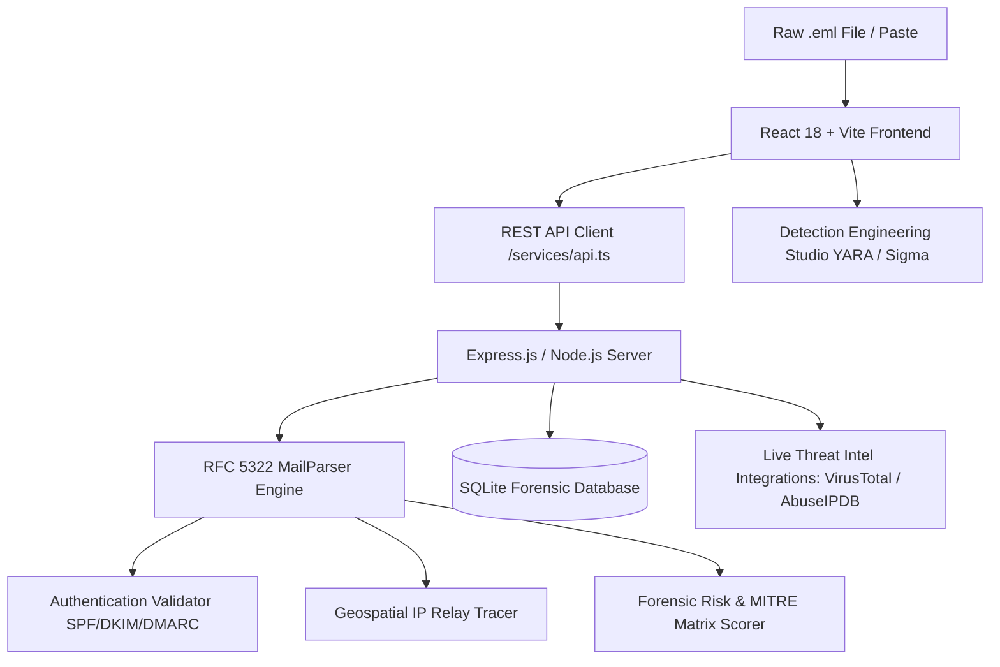

# 🛡️ MailTrace AI — Autonomous Email Threat Detection & Forensic Intelligence Platform

<p align="center">
  
  
  
  
  
  
</p>

---

## 📌 Overview

**MailTrace AI** is an enterprise-grade **Autonomous Email Security Operations Center (SOC) & Threat Forensics Platform**. Designed for tier-1/tier-2 SOC analysts and incident responders, MailTrace AI ingests raw RFC 5322 `.eml` files, disassembles transmission pathways, executes forensic header analysis, tracks IP relay hops across global infrastructure, and computes explainable multi-vector threat risk scores.

The platform empowers security teams to dismantle advanced spear phishing, CEO fraud/BEC (Business Email Compromise), malware dropper attachments, and credential harvesting campaigns in seconds.

---

## ✨ Key Capabilities & Features

### 🌓 1. Dynamic Dual-Engine SOC Theme (Cyber Dark & Crisp Light)
- **1-Click Theme Switcher**: Effortlessly switch between **Cyber SOC Obsidian Dark** (`#0B0F17`) with glowing emerald accents and **Crisp Emerald White** light mode.
- **Persistent State**: Retains user preference across browser sessions using `localStorage`.
- **Adaptive Satellite Map**: OpenStreetMap tiles automatically transition into high-contrast military cyber-recon dark mode.

### ⚡ 2. Global Forensic Command Palette (`Ctrl + K` / `Cmd + K`)
- Fast keyboard-driven workflow for instant operations.
- Quick navigation across Workspace, Threat Intel, Investigation Archives, and Case Management.
- Instant 1-click loading of realistic threat attack simulations.

### 🛡️ 3. Detection Engineering Studio (Live Rule Compiler)
- Automated extraction of Indicators of Compromise (IoCs) compiled into production-ready detection logic:
  - **YARA Signatures**: File and payload detection rules targeting attachment hashes, sender spoofing, and malicious subject patterns.
  - **Sigma Rules**: SIEM/XDR ingestion rules compatible with Splunk, Elasticsearch, and Microsoft Sentinel.
  - **Suricata / Snort Rules**: Network intrusion detection signatures for inbound SMTP traffic.
  - **1-Click File Export**: Download `.yar`, `.yml`, and `.rules` files directly to your SOC workstation.

### 🔬 4. RFC 5322 Raw Header Syntax Anomaly & Diff Inspector
- Side-by-side structured forensic table and raw header stream view.
- Real-time syntax highlighting for spoofed hops, forged `Received` headers, domain mismatches, and suspicious Mail Transfer Agents (MTAs).

### 🗺️ 5. Multi-Hop Geospatial Relay Tracer
- Leaflet-powered visual hop-by-hop tracking of the email relay journey across international ISPs and cloud networks.
- Built-in public fallback geolocation data with **zero mandatory API keys** required.

### 📊 6. SOC Analyst Dossier & MITRE ATT&CK Matrix
- **Explainable Threat Risk Engine**: 0–100 risk scoring with breakdown across Authentication (SPF/DKIM/DMARC), Sender Reputation, Body Sentiment, and Attachment Analysis.
- **MITRE ATT&CK Mapping**: Automatic alignment with techniques such as `T1566` (Phishing), `T1566.002` (Spearphishing Link), and `T1204` (User Execution).
- **Executive Security Summary**: Clear, jargon-free threat assessment generated for non-technical stakeholders.

### 📋 7. Incident Response Ticket Formatter
- 1-Click generation and clipboard copying of formatted incident response tickets ready for **Jira Service Management** and **ServiceNow ITSM**.

### 💼 8. Case Management & Chain of Custody Evidence Vault
- Automated cryptographic hashing (MD5, SHA-1, SHA-256) of raw email files and payload attachments.
- Full case escalation workflow: triage status, severity flags, and timestamped analyst notes.

---

## 🛠️ Architecture & Tech Stack



### Frontend
- **Framework**: React 18, TypeScript, Vite
- **Styling**: Tailwind CSS, CSS Variables for seamless Dark/Light themes
- **Icons**: Lucide React
- **Visualizations**: Recharts, Leaflet, React-Leaflet

### Backend
- **Server**: Node.js, Express, TypeScript
- **Parser**: `mailparser` (RFC 5322 compliant stream processor)
- **Database**: SQLite with `better-sqlite3` (zero-setup local storage)
- **Security**: JWT Authentication, bcrypt password hashing

---

## 🚀 Quickstart & Installation

### Prerequisites
- [Node.js](https://nodejs.org/) (v18 or higher recommended)
- `npm` (comes bundled with Node.js)
- `git`

### 1. Clone the Repository
```bash
git clone https://github.com/Aadityasingh08/MailtraceAI.git
cd MailtraceAI
```

### 2. Install Dependencies
```bash
# Install root, client, and server dependencies
npm run install:all
```
*(Or install manually in both `./client` and `./server`)*:
```bash
cd server && npm install
cd ../client && npm install
```

### 3. Environment Setup (Optional)
The application works immediately out-of-the-box with local SQLite and built-in sample intel. To connect optional external intelligence feeds:
```bash
cp server/.env.example server/.env
```
Configure your keys in `server/.env`:
```env
PORT=5000
JWT_SECRET=your-secure-jwt-secret
VIRUSTOTAL_API_KEY=your_key_here
ABUSEIPDB_API_KEY=your_key_here
```

### 4. 1-Click Launch

#### Windows (Instant Batch / PowerShell):
Double-click `start.bat` or run:
```powershell
.\start.ps1
```

#### Terminal / Cross-Platform:
```bash
# Terminal 1: Start Backend Server (Port 5000)
cd server
npm run dev

# Terminal 2: Start Client Workspace (Port 5173)
cd client
npm run dev
```

Open your browser at **`http://localhost:5173`** to access the MailTrace AI SOC Workspace.

---

## 🧪 Included Attack Scenarios (1-Click Simulations)

MailTrace AI includes pre-configured realistic forensic samples for demonstration and training:
1. **Executive Wire Transfer BEC (CEO Fraud)**: Spoofed display names, reply-to routing mismatch, urgency triggers.
2. **Credential Harvester (Microsoft 365 Phish)**: Homoglyph lookalike domains, credential capture URI redirection.
3. **Malicious Invoice Attachment (Trojan Dropper)**: Suspicious `.vbs` / executable payload with hash indicators.
4. **Clean Enterprise Newsletter**: Valid SPF, DKIM, and DMARC alignment passing all checks.

---

## 👥 Authors & Core Team

MailTrace AI was architected, engineered, and developed by:

| Name | Role | Profile |
| :--- | :--- | :--- |
| **Aditya Singh** | Full Stack AI Engineer | [](https://github.com/Aadityasingh08) |
| **Bhawna** | Full Stack AI Engineer | []() |

---

## 📄 License
This project is open-source and distributed under the **[MIT License](LICENSE)**.
