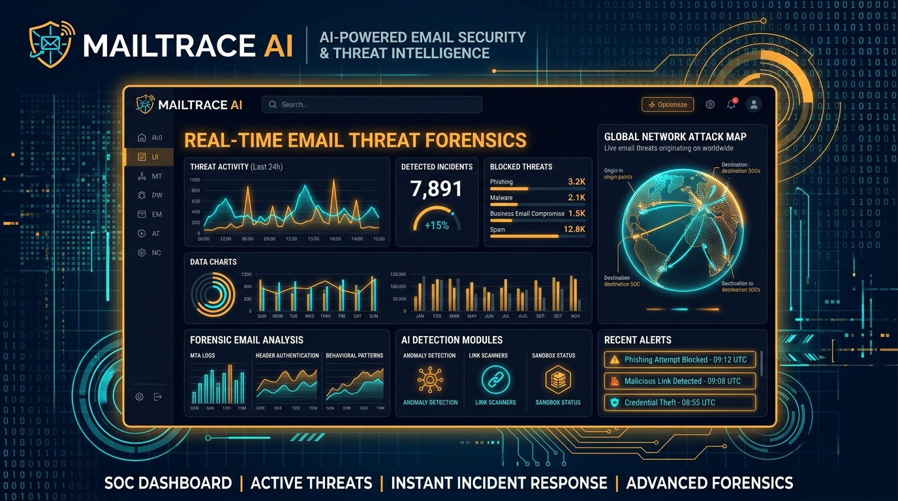
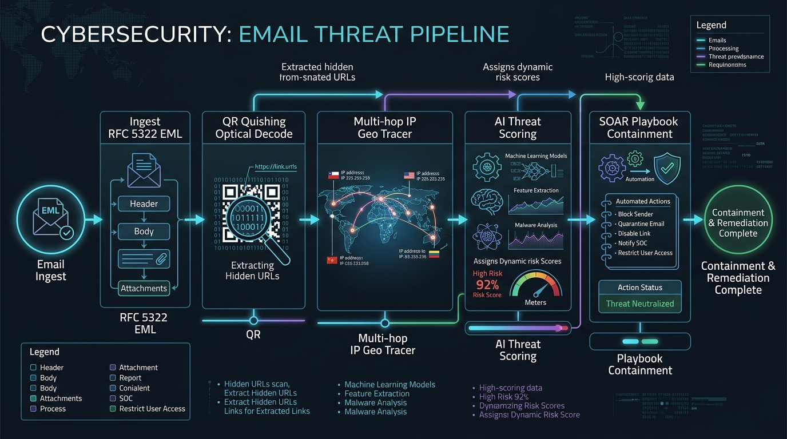
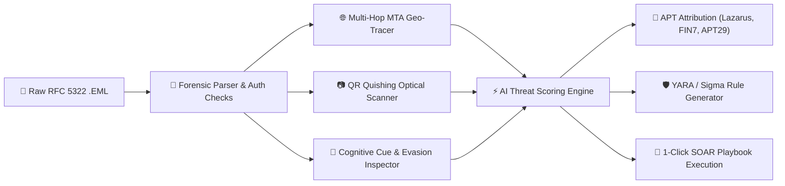
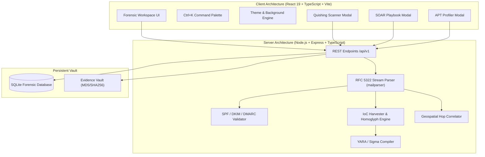

# 🛡️ MailTrace AI — Autonomous Email Threat Detection & Forensic Intelligence Platform

<p align="center">
  
</p>

<p align="center">
  <a href="https://mailtrace-ai-ten.vercel.app" target="_blank">
    
  </a>
  &nbsp;
  <a href="https://mailtraceai.onrender.com/health" target="_blank">
    
  </a>
  &nbsp;
  <a href="https://github.com/Aadityasingh08/MailtraceAI" target="_blank">
    
  </a>
</p>

<p align="center">
  
  
  
  
  
  
  
  
</p>

<p align="center">
  <b>An enterprise-grade Security Operations Center (SOC) platform for autonomous email parsing, RFC 5322 header forensics, multi-hop relay telemetry, optical QR Quishing analysis, threat actor attribution, and automated SOAR playbook containment.</b>
</p>

---

## 🌐 Live Production Links

* 🖥️ **Live Web Platform (Vercel)**: **[https://mailtrace-ai-ten.vercel.app](https://mailtrace-ai-ten.vercel.app)**
* ⚙️ **Forensic API Server (Render)**: **[https://mailtraceai.onrender.com/health](https://mailtraceai.onrender.com/health)**
* 📁 **Source Code Repository**: **[Aadityasingh08/MailtraceAI](https://github.com/Aadityasingh08/MailtraceAI)**

---

## 📌 Executive Overview

**MailTrace AI** is built specifically for Tier-1/Tier-2 SOC analysts, DFIR incident response teams, and threat intelligence researchers. It transforms raw RFC 5322 `.eml` files into **actionable, explainable forensic intelligence** in seconds.

By unifying optical QR code decoding, multi-hop MTA relay telemetry, state-sponsored APT attribution, and automated 1-click SOAR playbooks into a single cockpit, MailTrace AI dramatically reduces Mean Time to Detect (MTTD) and Mean Time to Remediate (MTTR) for critical phishing attacks.

---

## 🔄 End-to-End Threat Hunting Pipeline

<p align="center">
  
</p>



---

## 🌟 Visual Highlights & Key Features

| Category | Capability | Forensic Advantage |
| :--- | :--- | :--- |
| 📷 **Optical Forensics** | **Quishing (QR Phishing) Decoder** | Optical QR scanner extracts obfuscated credential harvesting URIs, checks homoglyphs, and audits multi-hop URL redirections. |
| 🦹 **Threat Attribution** | **State-Sponsored APT Profiler** | Matches campaign TTPs against known adversaries: **Lazarus Group (DPRK)**, **FIN7 (Carbanak)**, **APT29 (Cozy Bear)**, & **Scattered Spider**. |
| ⚡ **Incident Response** | **Automated SOAR Playbook** | 1-Click containment: domain perimeter firewall blocks, M365 OAuth session revocations, EDR sensor broadcasts, and Graph API mailbox purges. |
| 🧠 **Behavioral AI** | **Psychological & Evasion Inspector** | Measures cognitive pressure (Urgency, Authority, Scarcity, Fear) and unmasks zero-width spaces, 1px hidden micro-fonts, and web beacons. |
| 🗺️ **Transmission Path** | **Multi-Hop Relay Geo-Tracer** | Visual hop-by-hop tracking across international MTA nodes, identifying forged hops without requiring third-party API keys. |
| 🛡️ **Detection Eng.** | **Rule Compiler Studio** | Auto-synthesizes ingested IoCs into production-grade **YARA rules**, **Sigma detection rules**, and **Suricata NIDS** signatures. |
| 🎨 **Appearance** | **6 Atmosphere Backgrounds** | High-contrast readability: **Obsidian Velvet**, **Midnight Navy**, **Pure OLED Black**, **Warm Charcoal**, **Daylight Slate**, and **Crisp White**. |
| ⌨️ **Cockpit UX** | **Forensic Command Palette** | Instant `Ctrl + K` navigation across all tools, case investigations, attack simulations, and visual themes. |

---

## 🖥️ Live Terminal Forensic Output Preview

```log
[MAILTRACE-CORE] RFC 5322 Stream Ingestion Initialized...
[AUTH-CHECK] SPF: FAIL (-all) | DKIM: PERMFAIL (body hash mismatch) | DMARC: REJECT
[HOPS-TELEMETRY] Parsed 4 Received Hops:
  ├─ Hop 1: 185.220.101.5 (Tor Exit Node, DE) [SUSPICIOUS]
  ├─ Hop 2: 194.26.29.112 (Bulletproof Hosting, NL) [MALICIOUS - AbuseIPDB 100%]
  ├─ Hop 3: 40.107.22.84 (mail-eop.protection.outlook.com) [INTERNAL-RELAY]
  └─ Hop 4: 10.0.4.12 (Internal Perimeter Gateway) [TARGET]
[QUISHING-SCANNER] QR Code detected in inline CID attachment:
  └─ Decoded Payload: https://login.microsoftonline.sec-session-update.ru/auth?id=8831
  └─ Risk Classification: HIGH_RISK_CREDENTIAL_HARVESTER (Homoglyph detected)
[ATTRIBUTION-ENGINE] Threat Syndicate Match:
  └─ Match: FIN7 / Carbanak Syndicate (Confidence: 89%)
  └─ MITRE ATT&CK: T1566.002 (Spearphishing Link), T1204.001 (Malicious Link)
[SOAR-ENGINE] Ready to execute containment playbook.
```

---

## 🏛️ System Architecture



---

## ⌨️ Forensic Keyboard Shortcuts

| Shortcut | Action | Scope |
| :--- | :--- | :--- |
| <kbd>Ctrl</kbd> + <kbd>K</kbd> / <kbd>Cmd</kbd> + <kbd>K</kbd> | Open Global Command Palette & Tool Launcher | Global |
| <kbd>Esc</kbd> | Dismiss active modal or slide-over inspector | Global |
| <kbd>Ctrl</kbd> + <kbd>Enter</kbd> | Execute full email forensic analysis | Investigate Page |

---

## 📁 Repository Structure

```
MailtraceAI/
├── client/                     # Frontend Workspace (React 19 + TypeScript + Vite)
│   ├── src/
│   │   ├── components/         # SOC UI Components & Forensic Modals
│   │   │   ├── CommandPaletteModal.tsx        # Global Ctrl+K Command Palette
│   │   │   ├── QuishingScannerModal.tsx       # Optical QR Code Phishing Scanner
│   │   │   ├── ThreatActorProfilerModal.tsx   # Lazarus, FIN7, APT29 Profiler
│   │   │   ├── SoarPlaybookModal.tsx          # 1-Click Automated Containment
│   │   │   ├── PsychologicalCueInspector.tsx  # Cognitive Pressure & Evasion Meter
│   │   │   ├── DetectionRulesModal.tsx        # YARA, Sigma & Suricata Studio
│   │   │   ├── HeaderForensicsTable.tsx       # RFC 5322 Syntax Anomaly Diff
│   │   │   ├── GeoMap.tsx                     # Multi-Hop Visual World Map
│   │   │   └── ThemePickerModal.tsx           # Background Atmosphere Selector
│   │   ├── context/            # AuthContext & Multi-Theme Engine
│   │   ├── pages/              # Dashboard, Investigate, Cases, Intel, History
│   │   └── services/           # Axios API Client & Mock Intel Feeds
│   └── tailwind.config.js      # Adaptive SOC tokens & semantic variables
├── server/                     # Backend API & Threat Engine (Node.js + Express)
│   ├── src/
│   │   ├── ai/                 # Risk scoring & confidence heuristics
│   │   ├── controllers/        # Investigation, Cases, Intel, Auth endpoints
│   │   ├── intelligence/       # Header parsing, IoC extraction, lookalike domains
│   │   ├── models/             # SQLite schema and audit logging
│   │   └── parsers/            # RFC 5322 streaming mail parser
│   └── dist/                   # Production pre-compiled JavaScript bundle
├── docs/                       # Visual assets, banners, and diagrams
│   └── assets/
│       ├── mailtrace_hero_banner.jpg      # High-res SOC dashboard hero banner
│       └── email_threat_pipeline.jpg      # End-to-end forensic pipeline diagram
├── start.bat                   # 1-Click Windows Launcher
├── start.ps1                   # 1-Click PowerShell Launcher
├── stop.bat                    # 1-Click Graceful Shutdown
└── README.md                   # Comprehensive project documentation
```

---

## 🚀 Quickstart & Local Setup

### Prerequisites
* [Node.js](https://nodejs.org/) (v18.0 or higher)
* `npm` or `pnpm`
* `git`

### 1. Clone the Repository
```bash
git clone https://github.com/Aadityasingh08/MailtraceAI.git
cd MailtraceAI
```

### 2. Install All Dependencies
```bash
npm run install:all
```

### 3. Start Development Servers
#### Windows (1-Click):
```powershell
.\start.ps1
```

#### Linux / macOS (Manual):
```bash
# Terminal 1: Backend Server (Port 5000)
cd server && npm run dev

# Terminal 2: Frontend Workspace (Port 5173)
cd client && npm run dev
```

Open your browser at **`http://localhost:5173`**.

---

## 👥 Authors & Core Visionaries ❤️

<p align="center">
  <i>"Engineered with relentless passion, forensic precision, and cutting-edge artificial intelligence."</i>
</p>

<table align="center" style="border: none;">
  <tr>
    <td align="center" width="360" valign="top">
      <br />
      <a href="https://github.com/Aadityasingh08" target="_blank">
        
        <br /><br />
        <h3 style="margin: 0; color: #10B981;"><b>Aditya Singh ❤️</b></h3>
      </a>
      <p style="margin: 6px 0;"><b>⚡ Full Stack AI & Security Engineer</b></p>
      <p style="font-size: 13px; color: #64748B; margin: 4px 0 12px 0;">🛡️ <i>System Architecture • Threat Intelligence • RFC Forensics</i></p>
      <a href="https://github.com/Aadityasingh08" target="_blank">
        
      </a>
      &nbsp;
      <a href="https://github.com/Aadityasingh08?tab=followers" target="_blank">
        
      </a>
      <br /><br />
    </td>
    <td align="center" width="360" valign="top">
      <br />
      <a href="https://github.com/BhawnaBhadana" target="_blank">
        
        <br /><br />
        <h3 style="margin: 0; color: #F59E0B;"><b>Bhawna Bhadana ❤️</b></h3>
      </a>
      <p style="margin: 6px 0;"><b>⚡ Full Stack AI & Security Engineer</b></p>
      <p style="font-size: 13px; color: #64748B; margin: 4px 0 12px 0;">🔬 <i>Detection Engineering • Cyber SOC UI • YARA & Sigma</i></p>
      <a href="https://github.com/BhawnaBhadana" target="_blank">
        
      </a>
      &nbsp;
      <a href="https://github.com/BhawnaBhadana?tab=followers" target="_blank">
        
      </a>
      <br /><br />
    </td>
  </tr>
</table>

<div align="center">
  <p style="font-size: 15px; font-weight: 700; color: #1E293B;">
    Built with ❤️ by 
    <a href="https://github.com/Aadityasingh08" target="_blank" style="color: #10B981; text-decoration: none;"><b>Aditya Singh ❤️</b></a> 
    & 
    <a href="https://github.com/BhawnaBhadana" target="_blank" style="color: #F59E0B; text-decoration: none;"><b>Bhawna Bhadana ❤️</b></a>
  </p>
  <p style="font-size: 13px; color: #64748B;">
    ⭐ <i>If you find MailTrace AI useful, consider giving this repository a star!</i> ⭐
  </p>
  <p>
    <a href="https://github.com/Aadityasingh08/MailtraceAI/stargazers">
      
    </a>
    &nbsp;&nbsp;
    <a href="https://github.com/Aadityasingh08/MailtraceAI/network/members">
      
    </a>
  </p>
</div>

---

## 📄 License
This project is open-source under the **[MIT License](LICENSE)**.
